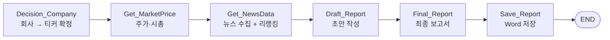

# 기업분석 AI 에이전트 / Company Analysis Agent (LangGraph)

> **English summary.** A multi-node LangGraph agent that turns a single company name into a full analysis report. It resolves the company to a stock ticker (DART corp registry + fuzzy matching), pulls market data via yfinance, gathers recent news by crawling Naver News and Tavily search, **re-ranks the articles with a BGE cross-encoder** so only genuinely relevant text reaches the model, then drafts and finalizes a report with an LLM (OpenAI or a local Ollama model) and saves it as a Word document.


---

## 개요

**회사 이름 하나만 입력하면 기업분석 보고서(Word)를 자동 생성**하는 에이전트입니다. LangGraph의 `StateGraph`로 6개 노드를 파이프라인으로 연결해, 각 단계가 공유 상태(`CompanyState`)를 채워가며 최종 보고서를 완성합니다.

단순 LLM 호출이 아니라 **실제 데이터를 수집·검증하는 과정**에 초점을 뒀습니다. 특히 뉴스는 크롤링한 뒤 그대로 넣지 않고 **임베딩 리랭커로 관련도를 재평가**해 노이즈를 걸러냅니다.

## 파이프라인



| 노드 | 역할 | 핵심 기술 |
|---|---|---|
| `Decision_Company` | 회사명·힌트 → 종목코드/티커 확정. DART 기업 목록에서 유사도 매칭, 코스피/코스닥 접미사(`.KS`/`.KQ`) 판별 | `dart-fss`, `rapidfuzz`, BeautifulSoup |
| `Get_MarketPrice` | 주가 시계열·시가총액 등 스냅샷 수집 | `yfinance` |
| `Get_NewsData` | 네이버 뉴스 URL 수집 → 본문 추출 → **관련도 리랭킹** → 상위 N개 선별 | `trafilatura`, Tavily, BGE CrossEncoder |
| `Draft_Report` | 수집 데이터를 근거로 분석 초안 생성 | `ChatPromptTemplate` + LLM |
| `Final_Report` | 초안을 다듬어 최종 보고서로 정리 | LLM |
| `Save_Report` | 보고서를 Word(.docx) 파일로 저장 | `python-docx` |

상태는 `CompanyState`(TypedDict)로 정의해 `ticker`, `price_df`, `news`, `analysis_draft`, `final_report`, `notes` 등을 노드 간에 전달합니다. 각 노드는 `notes`에 진행 기록을 남겨 실행 흐름을 추적할 수 있습니다.

## 구성 모듈

| 파일 | 설명 |
|---|---|
| [company_analysis_agent.py](src/company_analysis_agent.py) | 메인 에이전트 — 상태 정의, 6개 노드, 그래프 빌드·시각화 |
| [naver_latest_news_urls_v1.py](src/naver_latest_news_urls_v1.py) | 네이버 뉴스 최신 기사 URL 수집 (Playwright 기반) |
| [news_maintext_extract.py](src/news_maintext_extract.py) | 기사 본문 추출 (`trafilatura`) |
| [sentences_embedding_reranker.py](src/sentences_embedding_reranker.py) | BGE CrossEncoder 리랭커 — 질의–문장 관련도 재평가 |
| [tavily_search_urls.py](src/tavily_search_urls.py) | Tavily 웹 검색으로 보조 URL 확보 |

## 특징

- **LLM 전환 가능** — `OLLAMA_LLM` 플래그로 OpenAI API와 로컬 Ollama 모델을 바꿔가며 실행
- **리랭커 기반 노이즈 제거** — 검색·크롤링 결과를 그대로 쓰지 않고 CrossEncoder로 재정렬해 정확도 향상
- **그래프 시각화** — `networkx` + `matplotlib`으로 StateGraph 구조를 도식화
- **결과물 산출** — 분석 결과를 Word 보고서로 저장해 바로 활용 가능

## 실행 방법

```bash
pip install -r requirements.txt
playwright install chromium      # 뉴스 크롤링용

cp .env.example .env             # 키 입력 (OPENAI / TAVILY / DART)
python src/company_analysis_agent.py
```

> API 키는 반드시 `.env`로 관리하세요. 저장소에는 `.env.example`만 포함되어 있습니다.

## 참고

- 관련 저장소: [travel-planner-agent](https://github.com/NvidiaSeoul/travel-planner-agent)

---
> NVIDIA AI 코어 엔지니어 과정 — AI 에이전트 과제 · [전체 포트폴리오](https://github.com/NvidiaSeoul)
